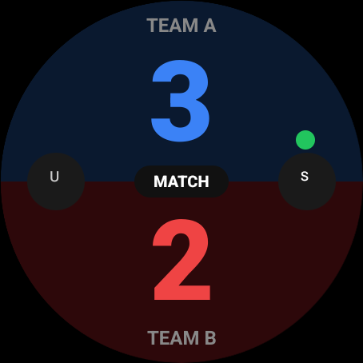
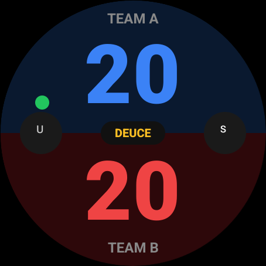
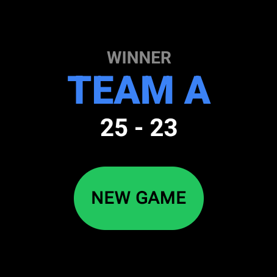

# 🏸 RALLY STAT

<p align="center">
  
</p>

<p align="center">
  <strong>A lightweight, standalone Wear OS application designed to keep track of badminton scores directly from your wrist.</strong>
</p>

<p align="center">
  
  
  
</p>

---

## 🚀 Why I Built This

As a badminton player, I kept running into a constant annoyance on the court: **forgetting the score mid-game and losing track of who was supposed to be serving from where.**

Looking up at a scoreboard isn't always an option, and pulling out a smartphone between points completely ruins the flow of a fast-paced game. I realized the perfect solution was already sitting on my wrist—a smartwatch. However, when I looked for apps, I couldn't find a clean, standalone tracker that worked exactly the way a player thinks during a match.

So, I decided to build **RALLY_STAT**.

### 🧩 The Development Journey & Challenges

Building an app for a tiny, circular wearable screen came with its own set of fun engineering puzzles:

* **The Scoring Logic:** Translating actual badminton rules into a clean algorithm took careful planning. Getting the app to instantly know your serving position based on whether the score is even or odd (e.g., remembering that a score of `2` means serving from the right court, which visually aligns to my left when looking at the wrist) had to be rock solid so I could trust it mid-match.
* **The Wear OS UI Puzzle:** Designing for a tiny screen is completely different from a phone. In early iterations, the UI elements fought for space, causing layout bugs where the match data and start icons would overlap on the circular boundaries. It took multiple rounds of reshaping the layouts to make it perfectly optimized for a quick glance while sweating on the court.
* **The "Sleep" Battle:** One of the final hurdles was realizing that Wear OS loves to aggressively sleep to save battery. During early testing, the watch would kick me back to the main face mid-game! Adding native `FLAG_KEEP_SCREEN_ON` configurations fixed this, ensuring the scoreboard stays awake and locked as long as the match is active.

> 💡 *This app started as a personal tool to fix my own court frustrations, but I’ve open-sourced it so any badminton enthusiast with a Wear OS device can keep their focus exactly where it belongs: on the game.*

---

## ✨ Features

* ⌚ **Wrist-Optimized UI:** Designed specifically for circular Wear OS device layouts, preventing text clipping and prioritizing high-contrast readability during active play.
* ⚡ **Always-On Scoring:** Utilizes `FLAG_KEEP_SCREEN_ON` to prevent the watch from sleeping or dropping back to the watch face mid-match.
* 🧠 **Smart Serving Logic:** Automatically calculates and tracks serving positions (Left/Right courts) dynamically based on the current player's score rules.
* 🚀 **Native Implementation:** Completely standalone application deployed via Android Studio—no companion phone app required.

---

## 📸 Screenshots

| Active Scoring | Deuce Mode 🔥 | Victory Screen |
| :---: | :---: | :---: |
|  |  |  |

---

## 🛠️ Technical Stack

| Component | Technology |
| :--- | :--- |
| **Platform** | Wear OS by Google |
| **Languages** | Kotlin, HTML, CSS |
| **UI Framework** | Jetpack Compose for Wear OS |
| **IDE** | Android Studio |

---

## 🏁 Getting Started

### Prerequisites
* Android Studio installed on your computer.
* A Wear OS smartwatch (e.g., OnePlus Watch 2, Galaxy Watch, Pixel Watch) **OR** a Wear OS Emulator configured in Android Studio.

### Installation & Deployment

1. **Clone the Repository:**
```bash
   git clone [https://github.com/SRMannan/BadmintonProScore.git](https://github.com/SRMannan/BadmintonProScore.git)
